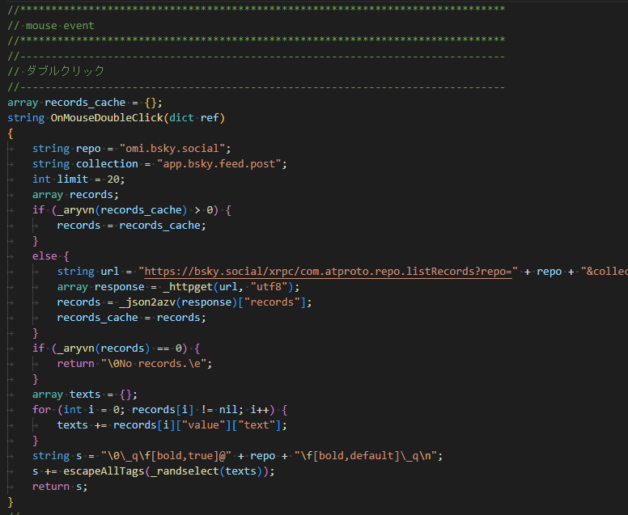

# 伺かゴースト「鎌倉さん」

Blueskyの鎌倉さん(omi.bsky.social)の投稿を喋るゴーストです。  
Blueskyのアカウントが無くてもデスクトップで鎌倉さんに会える！

## プレビュー

## 導入

[Releases](https://github.com/nikolat/ukagaka-kamakurasan/releases)からnarファイルをダウンロードしてください。  
ベースウェア本体[SSP](http://ssp.shillest.net/)は別途ご用意ください。

### Windows

- [ゴーストの使い方 - SSP](https://keshiki.nobody.jp/)

### Mac

- [【Big sur,Catalina対応】MacでWineを使って伺かを動かす。](https://c-lege.hacca.jp/ukgk/ukgk_at_mac.html)
- [PlayOnMac+SSP](https://tablesalt.o0o0.jp/ukagaka/ct_maconssp.html)

### Linux

- [Wine上でSSPを使い(first)さくらを起動する](https://qiita.com/ponapalt/items/c2c30b7bdb3c325a31f7)

## 注意事項

akari.dll がウイルス扱いされる場合がありますが、怪しいものではございません。  
うまいこと除外指定してください。

## 使用モジュール
灯(akari.dll) (c)un  
[夜天燈火](http://le.silk.to/)
